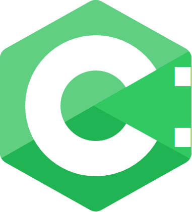

<p align="center">
  
</p>

# CColon (C:)

CColon is a bytecode-compiled programming language built in Go. It takes the readability of Python, the structure of Go, the expressiveness of Kotlin, and wraps it all into a language that is genuinely enjoyable to write.

CColon compiles source code to bytecode and executes it on a stack-based virtual machine. Go's garbage collector handles memory management, so you never have to think about it.

## Features

- **Clean syntax** with Python-like readability
- **Bytecode VM** for fast execution
- **Garbage collected** through Go's runtime
- **Dynamic lists** and **fixed-size arrays**
- **First-class functions** with parameters and return values
- **Interactive REPL** for quick experimentation
- **Cross-platform** binaries for Linux, macOS, and Windows

## What it looks like

```
import console

function factorial(int n) int {
    if (n <= 1) {
        return 1
    }
    return n * factorial(n - 1)
}

function main() {
    var string name = "CColon"
    console.println("Welcome to " + name + "!")

    for i in range(1, 8) {
        console.println(i.tostring() + "! = " + factorial(i).tostring())
    }

    var list scores = [95, 87, 92, 78]
    scores.append(100)
    console.println("Scores: " + scores.tostring())
}
```

## Getting started

Head over to the [Installation](getting-started/installation.md) page to get CColon on your machine, then check out the [Hello World](getting-started/hello-world.md) guide.
